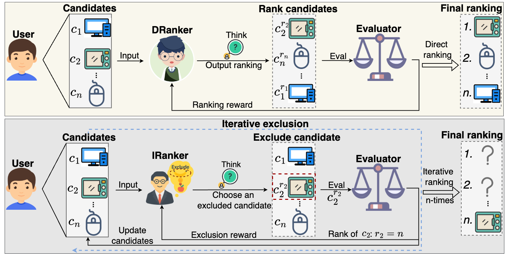

# GraphEval: A Lightweight Graph-Based LLM Framework for Idea Evaluation

<p align="center">
    <a href="https://ulab-uiuc.github.io/GraphEval/">
        
    </a>
    <a href="https://openreview.net/pdf?id=5RUM1aIdok">
        
    </a>
    <!-- <a href="xxx">
        
    </a> -->
    <a href="https://github.com/ulab-uiuc/GraphEval/blob/master/LICENSE">
        
    </a>
    <br>
    <a href="https://github.com/ulab-uiuc/GraphEval">
        
    </a>
    <a href="https://github.com/ulab-uiuc/GraphEval">
        
    </a>
    <a href="https://github.com/ulab-uiuc/GraphEval">
        
    </a>
</p>


<p align="center">
    <a href="https://ulab-uiuc.github.io/GraphEval/">🌐 Project Page</a> |
    <a href="https://arxiv.org/abs/2503.12600">📜 arXiv</a>
    <!-- <a href="xxx">📮 Twitter Post</a> -->
<p>


<!--  -->

<div align="center">
  
</div>


## News

**[2025.01.22]** 🌟 GraphEval is accepted for ICLR 2025.


## 📌Preliminary


### Environment Setup

```shell
# create a new environment
conda create -n grapheval python=3.10
conda activate grapheval

# install pytorch. Modify the command to align with your own CUDA version.
pip3 install torch  --index-url https://download.pytorch.org/whl/cu118

# install related libraries
pip install -r requirements.txt


# install pyg
pip install torch_geometric
pip install pyg_lib torch_scatter torch_sparse torch_cluster torch_spline_conv -f https://data.pyg.org/whl/torch-2.1.0+cu118.html

```

### Dataset Preparation

We have three datasets to choose from, namely ICLR_Dataset, AI_Researcher and Review_Advisor.
You can find the dataset files in the `Data/[DATASET_NAME]` folder.


## ⭐Experiments


### Viewpoint-Graph Extraction

Generate viewpoint nodes and edges.

```bash
# DATASET Choices: ICLR_Dataset, AI_Researcher and Review_Advisor
python models/Graph_Extraction.py
```


### Training and Evaluation

Run experiments and print/save evaluation results on metrics accuracy, precision, recall, and F1 Score.


```bash
# Method Choices: GraphEval_GNN, GraphEval_LP, Baselines
python run_exp.py --method_name [Method]
```


## Citation

```bibtex
@inproceedings{fenggrapheval,
  title={GraphEval: A Lightweight Graph-Based LLM Framework for Idea Evaluation},
  author={Feng, Tao and Sun, Yihang and You, Jiaxuan},
  booktitle={The Thirteenth International Conference on Learning Representations}
}
```


<!-- <picture>
<source media="(prefers-color-scheme: dark)" srcset="https://api.star-history.com/svg?repos=ulab-uiuc%2FGraphEval&theme=dark&type=Date">

</picture> -->
